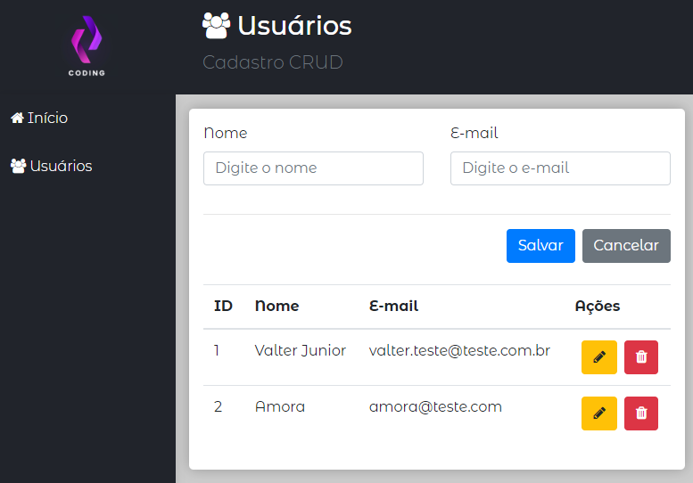
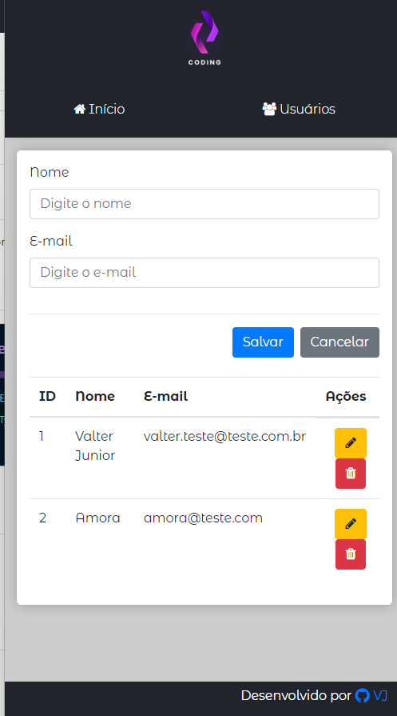

<h1 align="center">CRUD com React e db.json </h1>

 🚀 Estudo de React

<h1 align="center"></h1>

•
 <a href="#objetivo">Objetivo</a> •
 <a href="#tecnologias">Tecnologias</a> • 
 <a href="#autor">Autor</a> •

<h1 align="center">
    
    
    
</h1>

## **Objetivo**

 🔍 Estudando um pouco mais sobre React 

## **Tecnologias**

<ul>⚙️ Backend
    <li>🛠 JSON Server
    <li>🛠 Axios
   
</ul>
<ul>⚙️ Frontend    
    <li>🛠 React
    <li>🛠 Bootstrap
    <li>🛠 font-awesome

## **Autor**

 Desenvolvido por <a href="https://github.com/valtercfjunior">Valter Junior</a> 

 Créditos: <a href="https://www.cod3r.com.br/">Cod3r</a> 

